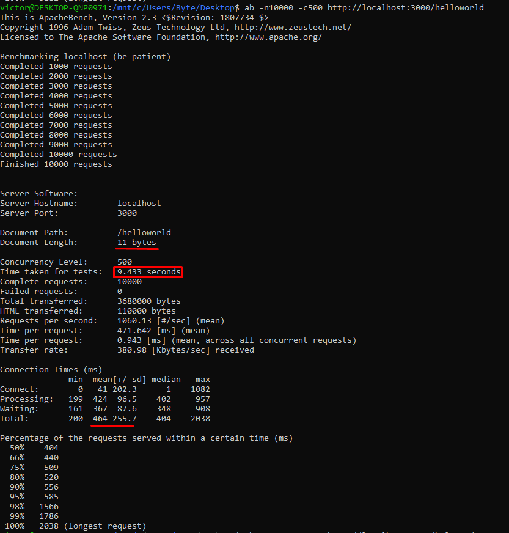
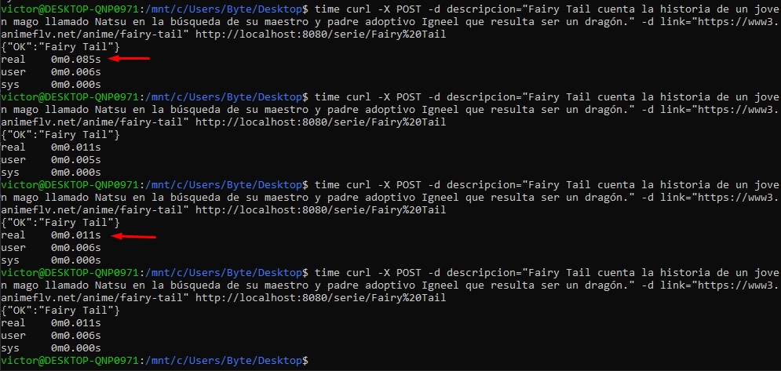
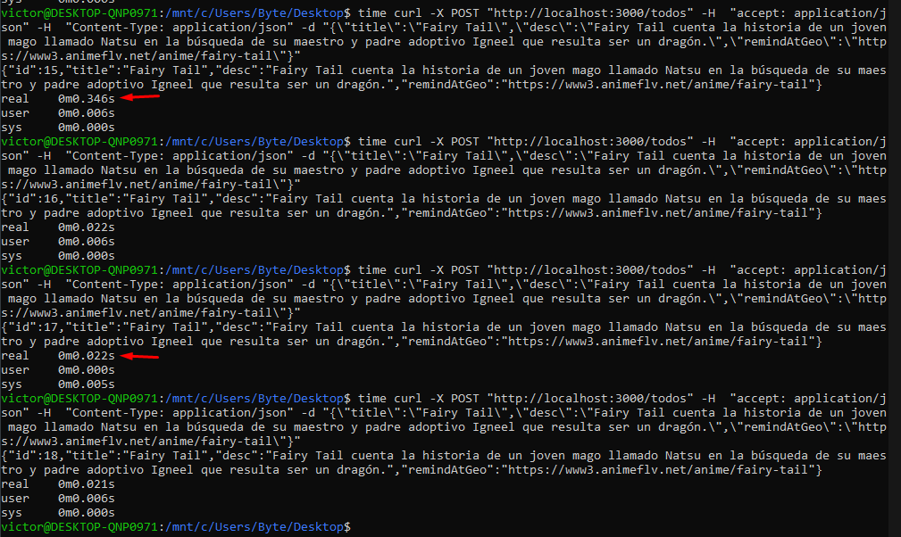
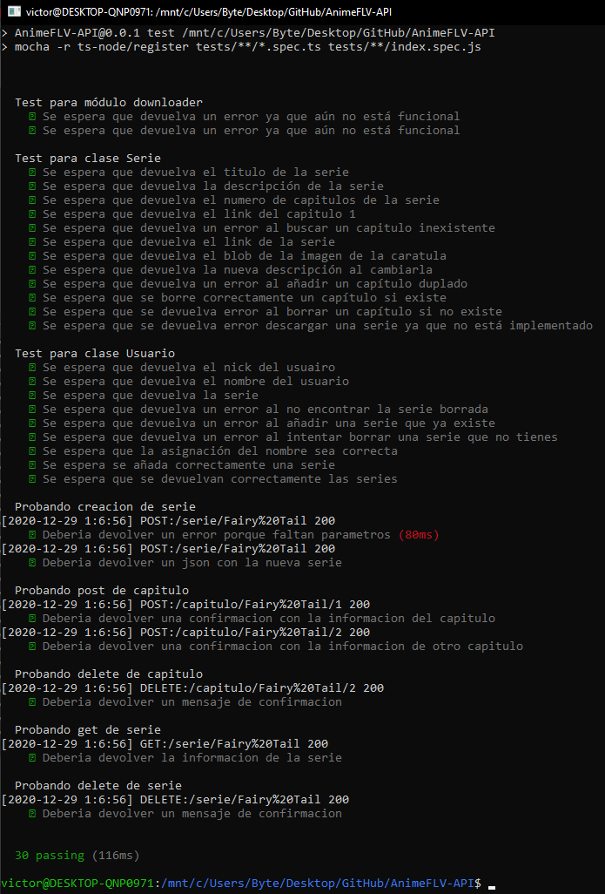

 

     

# AnimeFLV-API              	(ﾉ◕ヮ◕)ﾉ*:･ﾟ✧ 

Este proyecto tiene como objetivo crear una API para interactuar con la web de anime, AnimeFLV de forma sencilla y automatizada.

## Motivación del proyecto 🦾

Como seguidor del anime y activo usuario de esta web, me he visto en más de una ocasión refrescando una y otra vez la página para ver si había salido ya un nuevo capítulo de cualquiera fuera la serie que seguía en ese momento o pasando por 4 links diferentes para descargar algún capítulo.
### ¿Qué se pretende desarrollar? 👨🏻‍💻
El objetivo es automatizar las tareas anteriormente comentadas, en un principio los objetivos son:

 - Crear funciones para marcar series y que se puedan recibir notificaciones cuando haya un nuevo capítulo.
 - Crear funciones que notifiquen la aparición de una nueva serie.
 - Crear funciones que faciliten la descarga automatizada de capítulos. 

## Microservicio

Hemos seleccionado express.js como framework para el microservicio, esta decisión se debe a que era un framework con mucha documentación para el lenguaje utilizado (typescript) y que cuenta con muchas facilidades pero a su vez es bastante versatil, además está diseñado para utilizarse con node.js que es el entorno que utilizamos en este proyecto, lo que lo hace un framework adecuado para el objetivo a realizar.

También se barajó el uso de otros frameworks más centrados en Typescript, como Loopback, que se basa en express.js, pero cuenta con una documentación menos extensa y en general, no parece ser un framework tan sólido como express.
Se puede ver más información sobre los pros y contras de loopback [en el siguiente enlace](https://www.voidcanvas.com/loopback-pros-and-cons/)

Para asegurarnos de que hacemos una elección correcta, vamos a comparar el rendimiento de ambos frameworks simulando peticiones iguales que las de nuestro proyecto con loopback y con express.

Primero vamos a hacer un test simple de la ruta GET con un hola mundo, ambos devuelven exactamente la misma cadena para que sea un test justo.

Para ello vamos a emplear la herramienta de apache ab, esta herramienta sirve para mandar muchas peticiones de forma concurrente y devuelve todos los datos que necesitamos para juzgar cual es mas rápido.

En ambos tests mandamos 10000 peticiones con una concurrencia de 500.

**Express:**

> ab -n10000 -c500 http://localhost:8080/holamundo

**LoopBack:**

> ab -n10000 -c500 http://localhost:3000/helloworld

**Conclusión HolaMundo**

Como podemos ver, ambos devuelven lo mismo (11 bytes), pero express es mucho significativamente más rápido que loopback en responder peticiones get que devuelven poca información (las cuales serán la mayoría de las peticiones que recibirá el microservicio).
Esto probablemente se debe a la complejidad de loopback respecto a la de express. Express.js es un framework mas sencillo.

**PRUEBAS POST**

Ahora vamos a hacer pruebas con el segundo método que mas se utilizará en el microservicio, un POST, con 2 parámetros envíados por el body.
En este caso no haremos uso de la herramienta ab de apache si no de la herramienta curl, en las peticiones POST, es la primera petición por norma general la que tiene un tiempo de respuesta mas largo aunque siempre devuelva lo mismo (comportamiento idempotente), esto se debe a que estamos mandando información al servidor para que la guarde (en nuestro microservicio) y esta solo se guarda una vez, ya que al recibir la misma petición ya tiene la información. Por esto, no tiene sentido mandar 10000 peticiones, basta con ver las diferencias entre la primera petición y algunas de las repetidas para ver la diferencia de rendimiento.

**Express**

**Loopback**

Como vemos en el método post la primera vez que el servidor lo recibe tarda más que en el resto de los casos, esto se debe a que solo introduce los datos la primera vez que los recibe, el resto de ocasiones devuelve la misma respuesta ya que POST tiene un comportamiento idempotente pero tarda mucho menos ya que no tiene que añadir de nuevo los datos.

En este caso express.js también gana la prueba de rendimiento, es mucho más rápido tanto la primera vez que recibe la petición como en el resto.

### **Conclusión**

Como vemos Express.js ha ganado en ambas pruebas de rendimiento para los métodos que vamos a utilizar en nuestro microservicio, además, como hemos comentado anteriormente, es un framework mucho mas sencillo que loopback, que cuenta con más documentación y que es más sencillo de implementar, nuestro microservicio es bastante simple así que no necesitamos más.
Por ello si no solo es mas simple si no que además tiene un mejor rendimiento para el uso que le vamos a dar, express.js es la opción adecuada.

### Microservicio con Express.js

[Fichero que implementa el microservicio index.ts](https://github.com/bytevictor/AnimeFLV-API/blob/master/src/index.ts).

En este fichero hemos empleado express.js e implementado varias rutas para las distintas funcionalidades de la API.
Siempre que una petición es correcta devuelve datos en formato JSON, ya sea confirmando, por ejemplo, que los datos introducidos son correctos en el caso de las peticiones POST y DELETE (y además mostrando esos datos en JSON) o devolviendo los datos solicitados en formato JSON en el caso de las peticiones de tipo GET.
Cuando la petición es incorrecta devuelve un mensaje de texto plano con la razón del error, además de devolver el código HTTP asociado al error. 

Las rutas disponibles son las siguientes:

**POST**

Añade una nueva serie al microservicio (los parámetros **descripcion** y **link** se obtienen por el body de la petición.)
> localhost:8080/serie/:nombreserie

**GET** 

Devuelve una serie con toda su información asociada

> localhost:8080/serie/:nombreserie

**GET**

Devuelve el link de un capítulo de una serie

> localhost:8080/capitulo/:nombreserie/:numcapitulo

**POST**

Añade un capítulo a una serie (el parámetro **link** se obtiene por el body de la petición)

> localhost:8080/capitulo/:nombreserie/:numcapitulo

**DELETE**

Borra un capítulo de una serie

> localhost:8080/capitulo/:nombreserie/:numcapitulo

**DELETE**

Borra una serie del microservicio

> localhost:8080/serie/:nombreserie

Todas estas funcionalidades avanzan significativamente concretamente DOS de las historias de usuario, la HU01 y HU03, obtención de datos de series y capítulos de las mismas y la posibilidad de descargar series y capítulos, la HU01 está prácticamente implementada con este microservicio aunque aún puede mejorarse y esta funcionalidad facilita mucho la posibilidad de descargar capítulos ya que se pueden obtener fácilmente listas con los links a los mismos, en un futuro podría implementarse una funcionalidad que permita a partir de esos links que proporciona la API la descarga automatizada de capítulos.

### Configuración distribuida

La configuración del microservicio es distribuida, se intentan obtener los parámetros necesarios de una instancia etcd, si los parámetros no se pueden obtener, se asignan valores por defecto.

En principio solo se obtiene por el momento el puerto para la aplicación de forma distribuida ya que no tenemos ningun otro parámetro significativo que podamos definir.

Se intenta obtener de una instancia etcd con ip **127.0.0.1** y puerto **2379**

El variable que se intenta obtener debe tener el nombre **port**

Si no se encontrase se asigna el puerto **8080** por defecto.

La configuración distribuida está implementada [en el siguiente fichero](https://github.com/bytevictor/AnimeFLV-API/blob/master/src/server.ts)

### Middleware

Además de las funcionalidades del microservicio se ha implementado un middleware que almacena todas las peticiones que recibe el microservicio en un archivo log.txt.
Al ser un middleware es capaz de acceder a la instancia de express y ejecutar su código cada vez que esta recibe una petición de cualquier tipo.
Este middleware crea una carpeta en la raiz del proyecto llamada log donde almacena el archivo logs.txt, crea una carpeta porque es la forma común de almacenar logs ya que suelen ser ficheros de gran tamaño y puede necesitarse crear varios cuando uno alcanza demasiado tamaño, aunque en este caso todo aún se almacena en el mismo fichero.
Cada entrada del log almacena fecha, hora, metodo de la petición, url y el código de estado que devuelve.

Ejemplo entrada de log:

> [2020-12-12 2:17:47] GET:/getserie/Fairy%20Tail 200

El código del middleware se ha implementado en el mismo fichero que el resto del microservicio.

[Código implementación del sistema de logs (middleware) Lineas 19-58](https://github.com/bytevictor/AnimeFLV-API/blob/master/src/index.ts)

### Tests

Se han implementado tests para todas las rutas del microservicio, los cuales comprueban el correcto funcionamiento de este.

Para mandar las peticiones al microservicio se ha empleado la biblioteca supertest, ya que había mucha documentación asociada a esta con express y además se puede usar una biblioteca de aserciones propia, una de las recomendadas era mocha/chai que es la misma que usamos en el resto de los tests, por tanto nos venía como anillo al dedo.

[El código de los tests se puede comprobar AQUÍ](https://github.com/bytevictor/AnimeFLV-API/blob/master/tests/index.spec.js)

Podemos ver como los tests pasan de forma satisfactoria: 

## Documentos

- [Documentación de los Sistemas Serverless]()

- [Documentación de la Integración Continua](https://github.com/ByteVictor/AnimeFLV-API/blob/master/docs/integracioncontinua/ci.md)

- [Documentación de Docker, imágenes y DockerHub](https://github.com/ByteVictor/AnimeFLV-API/blob/master/docs/doc_docker/docker.md)

- [Información sobre tests y cómo testear el proyecto](https://github.com/bytevictor/AnimeFLV-API/blob/master/docs/tests/tests.md)

- [Herramientas de desarrollo 🧰](https://github.com/bytevictor/AnimeFLV-API/blob/master/docs/herramientas/herramientas.md)

- [Primera aproximación al código](https://github.com/ByteVictor/AnimeFLV-API/blob/master/src/serie.ts)
Algunos atributos no cuentan con setter debido a que no se contempla que puedan cambiar después de construirse el objeto, si en un futuro son necesarios se añadirán.

- Ver los [PASOS 🦶](https://github.com/ByteVictor/AnimeFLV-API/blob/master/docs/pasos/pasos.md) a realizar 

- Ver [Historias de Usuario📚](https://github.com/ByteVictor/AnimeFLV-API/blob/master/docs/historias_usuario/historiasdeusuario.md )

- La configuración inicial de github puede verse [AQUÍ](https://github.com/ByteVictor/AnimeFLV-API/blob/master/docs/configuracion_inicial/configuracion_inicial.md)

## Autor
[Víctor González Argudo / ByteVictor](https://github.com/ByteVictor) 